111
# 复杂 Markdown 渲染能力验收文档

> 这是一份用于测试 Markdown 编辑器渲染能力的复杂文档。
>
> 目标覆盖：基础 Markdown、扩展语法、代码高亮、表格、任务列表、Mermaid、PlantUML、数学公式、HTML、脚注、图片、折叠块、复杂嵌套结构等。

---


> []()


123123

------


[^12312313]: 123123123

222sss


## 目录

- [1. 文档概览](#1-文档概览)
- [2. 基础文本格式](#2-基础文本格式)
- [3. 列表与任务](#3-列表与任务)
- [4. 表格](#4-表格)
- [5. 代码块](#5-代码块)
- [6. Mermaid 图表](#6-mermaid-图表)
- [7. PlantUML 图表](#7-plantuml-图表)
- [8. 数学公式](#8-数学公式)
- [9. 图片与链接](#9-图片与链接)
- [10. HTML 混排](#10-html-混排)
- [11. 折叠块](#11-折叠块)
- [12. 脚注与引用](#12-脚注与引用)
- [13. 综合业务示例](#13-综合业务示例)

---

# 1. 文档概览

本文档模拟一个“法币充值匹配流程升级”的技术方案与测试文档，内容故意设计得比较复杂，适合验证 Markdown 编辑器在以下场景下的表现：

| 能力 | 是否覆盖 | 说明 |
| :--- | :---: | :--- |
| 多级标题1<br>围绕<br>阿斯顿发<br>232<br>2323 | ✅ | H1 ~ H6 |
| 表格 | ✅ | 普通表格、复杂表格、对齐方式 |
| 代码块 | ✅ | Java、SQL、JSON、YAML、Bash、TypeScript |
| Mermaid | ✅ | flowchart、sequenceDiagram、stateDiagram、erDiagram、gantt、pie |
| PlantUML | ✅ | sequence、class、component、state、activity |
| 数学公式 | ✅ | 行内公式与块级公式 |
| HTML 混排 | ✅ | details、kbd、mark、div |
| 脚注 | ✅ | footnote |
| 图片 | ✅ | Markdown 图片与 HTML 图片 |
| 引用块 | ✅ | 普通引用、嵌套引用、GitHub 风格提示 |

---

## 2. 基础文本格式

### 2.1 普通段落

这是一个普通段落，用来测试 Markdown 的基础渲染能力。段落中包含中文、English words、数字 `123456`、符号 `@#$%^&*()`，以及一些技术术语：幂等、状态机、补偿任务、资金安全、最终一致性。

这是第二个段落，用于测试段落之间的间距是否合理。

### 2.2 强调与删除线

- **这是加粗文本**
- *这是斜体文本*
- ***这是加粗 + 斜体***
- ~~这是删除线~~
- `这是行内代码`
- <mark>这是 HTML 高亮文本</mark>
- H~2~O
- x^2^

### 2.3 行内混排

在 Java 中，`BigDecimal` 适合处理金额，不能直接用 `double`。例如：

> 充值金额 `notificationAmount = 100.00`，钱包订单金额 `amount = 100.00`，两者匹配后进入 `handleMatched -> triggerMainFlow`。

### 2.4 多级标题

#### H4 标题

##### H5 标题

###### H6 标题

---

## 3. 列表与任务

### 3.1 无序列表

- 状态一致性
  - 撤销
  - 失效
  - 回调
  - 补偿
- 资金安全
  - 重复上账
  - 漏上账
  - 错误匹配
- 可观测性
  - 日志
  - 指标
  - 告警

### 3.2 有序列表

1. 接收钱包侧银行订单。
2. 写入幂等表 `t_fiat_wallet_order`。
3. 根据 `client_id + state + notification_amount` 查询充值通知单。
4. 建立匹配关系。
5. 推进主流程。
6. 触发审批、风控或上账。

### 3.3 任务列表

- [x] 创建钱包订单幂等表
- [x] 增加未匹配订单补偿任务
- [x] 支持已匹配订单重入
- [x] 补充资金安全专项用例
- [x] 增加 Nightingale 指标
- [x] 完成生产灰度方案

### 3.4 复杂嵌套列表

1. 主流程
   1. 初始化
      - `INIT`
      - `PROCESSING`
   2. 待补充
      - `INFO_PENDING`
      - `PENDING`
   3. 风控审批
      - `WORLD_CHECKING`
      - `APPROVING`
2. 异常流程
   - 撤销
     1. 用户主动撤销
     2. 运营手动撤销
   - 失效
     1. 超时未匹配
     2. 信息不完整
   - 失败
     1. 可退款失败
     2. 不退款失败

---

## 4. 表格

### 4.1 普通表格

| 字段 | 类型 | 是否必填 | 说明 |
|---|---|---:|---|
| id | bigint | 是 | 自增主键 |
| order_id | varchar(64) | 是 | 钱包侧订单 ID |
| client_id | varchar(64) | 是 | 客户 ID |
| amount | decimal(32, 18) | 是 | 金额 |
| state | varchar(32) | 是 | 状态 |
| create_time | datetime | 是 | 创建时间 |

### 4.2 对齐测试

| 左对齐 | 居中对齐 | 右对齐 |
|:---|:---:|---:|
| INIT | 初始化 | 1 |
| PROCESSING | 处理中 | 20 |
| COMPLETED | 完成 | 300 |

### 4.3 复杂表格

| 场景 | 前置状态 | 触发动作 | 预期结果 | 风险等级 |
|---|---|---|---|---|
| 已匹配订单重复补偿<br>123123 | `MATCHED` | CompensationJob 重跑 | 不重复上账，主流程可重入 | P0 |
| 钱包回调重复请求 | `PROCESSING` | callback 重试 | 幂等处理 | P0 |
| 充值单已撤销 | `CANCELLED` | 钱包订单匹配 | 不允许继续推进 | P0 |
| 充值单已失效 | `EXPIRED` | 钱包订单匹配<br>123123123123<br>123123<br>123123<br>123123<br>123123 | 不允许继续推进1<br>123123 | P0 |
| 金额不一致 | `INIT` | 匹配 | 匹配失败，进入未匹配池 | P1 |

---

## 5. 代码块

### 5.1 Java

```java
public class FiatDepositMatchService {

    private final FiatDepositOrderRepository depositOrderRepository;
    private final FiatWalletOrderRepository walletOrderRepository;

    public MatchResult match(WalletOrder walletOrder) {
        if (walletOrder == null) {
            throw new IllegalArgumentException("walletOrder must not be null");
        }

        if (walletOrder.isMatched()) {
            return handleMatched(walletOrder);
        }

        Optional<DepositOrder> depositOrder = depositOrderRepository.findMatchable(
            walletOrder.getClientId(),
            walletOrder.getCurrency(),
            walletOrder.getAmount()
        );

        if (depositOrder.isEmpty()) {
            return MatchResult.unmatched(walletOrder.getOrderId());
        }

        return bindAndTrigger(walletOrder, depositOrder.get());
    }

    private MatchResult handleMatched(WalletOrder walletOrder) {
        // 要求 triggerMainFlow 支持幂等重入
        return triggerMainFlow(walletOrder.getDepositOrderId());
    }

    private MatchResult bindAndTrigger(WalletOrder walletOrder, DepositOrder depositOrder) {
        walletOrder.bindDepositOrder(depositOrder.getId());
        walletOrderRepository.save(walletOrder);
        return triggerMainFlow(depositOrder.getId());
    }
}
```

### 5.2 SQL

```sql
ALTER TABLE atlas_biz_dw.t_fiat_wallet_order
    ADD UNIQUE KEY uk_order_id (order_id),
    ADD KEY idx_unmatched (order_type, deposit_order_id, state, create_time);

ALTER TABLE atlas_biz_dw.t_fiat_deposit_order
    ADD KEY idx_deposit_order_match (client_id, state, notification_amount);

SELECT
    d.id,
    d.client_id,
    d.state,
    d.notification_amount,
    w.order_id,
    w.amount
FROM t_fiat_deposit_order d
LEFT JOIN t_fiat_wallet_order w
    ON d.id = w.deposit_order_id
WHERE d.state IN ('INIT', 'PROCESSING')
  AND d.deleted = 0
ORDER BY d.create_time DESC
LIMIT 100;
```

### 5.3 JSON

```json
{
  "orderId": "WO202606210001",
  "clientId": "CID_10001",
  "externalUserId": "PX_USER_90001",
  "currency": "USD",
  "amount": "100.00",
  "state": "UNMATCHED",
  "matched": false,
  "metadata": {
    "source": "bank_callback",
    "retryCount": 3,
    "idempotentKey": "WO202606210001"
  }
}
```

### 5.4 YAML

```yaml
fiat:
  deposit:
    match:
      enabled: true
      timeoutDays: 3
      compensation:
        enabled: true
        cron: "0 */5 * * * ?"
    risk:
      worldCheckingEnabled: true
      manualReviewThreshold: "10000.00"
```

### 5.5 Bash

```bash
#!/usr/bin/env bash

set -euo pipefail

APP_NAME="atlas-module-dw"
PROFILE="test"

echo "Starting ${APP_NAME} with profile=${PROFILE}"

java \
  -Dspring.profiles.active="${PROFILE}" \
  -Dfile.encoding=UTF-8 \
  -jar "${APP_NAME}.jar"
```

### 5.6 TypeScript

```typescript
type DepositState =
  | "INIT"
  | "PROCESSING"
  | "INFO_PENDING"
  | "PENDING"
  | "WORLD_CHECKING"
  | "APPROVING"
  | "CREDITING"
  | "FAILED"
  | "TO_REFUND"
  | "REFUND"
  | "COMPLETED"
  | "CANCELLED"
  | "EXPIRED"
  | "FAILED_NO_REFUND";

interface StateTransition {
  from: DepositState;
  to: DepositState;
  reason: string;
  operator?: string;
}

const transition: StateTransition = {
  from: "PROCESSING",
  to: "CANCELLED",
  reason: "user_cancel"
};

console.log(transition);
```

---

## 6. Mermaid 图表

### 6.1 Mermaid Flowchart：主流程

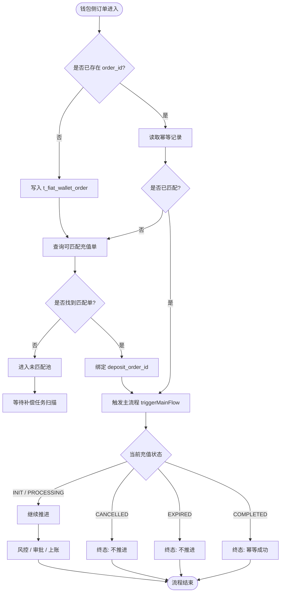

### 6.2 Mermaid Sequence：钱包回调与匹配

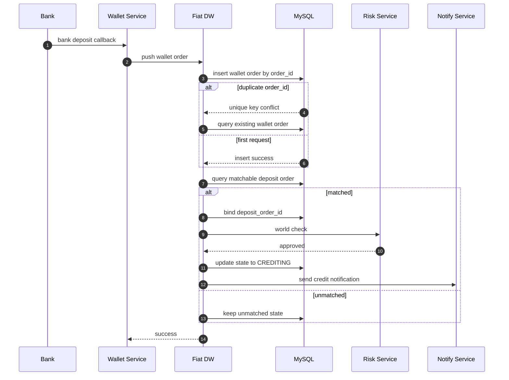

### 6.3 Mermaid State Diagram：法币充值状态机

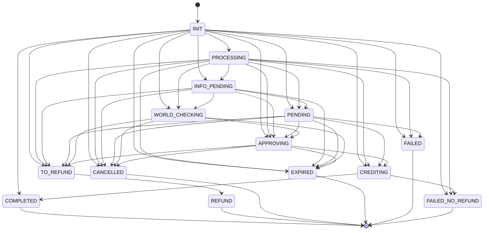

### 6.4 Mermaid ER Diagram

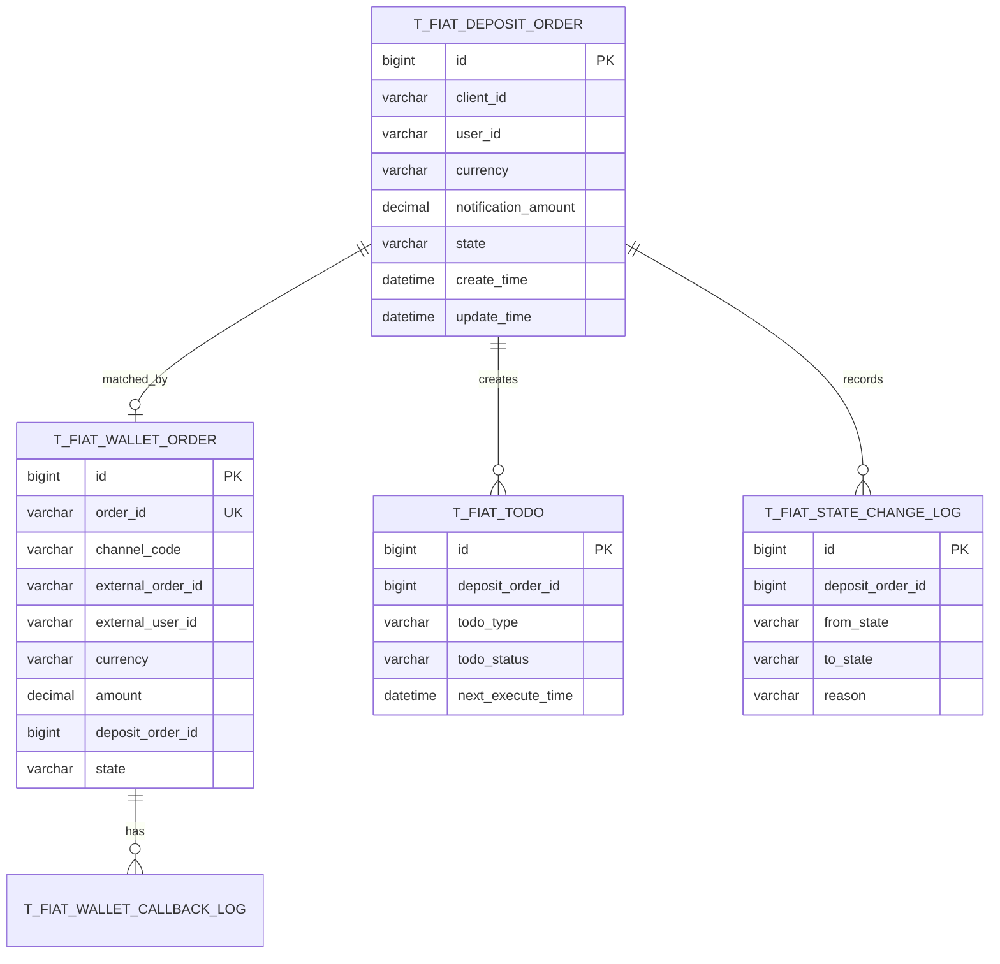

### 6.5 Mermaid Gantt

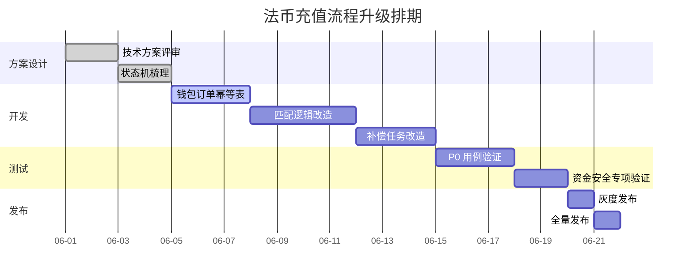

### 6.6 Mermaid Pie

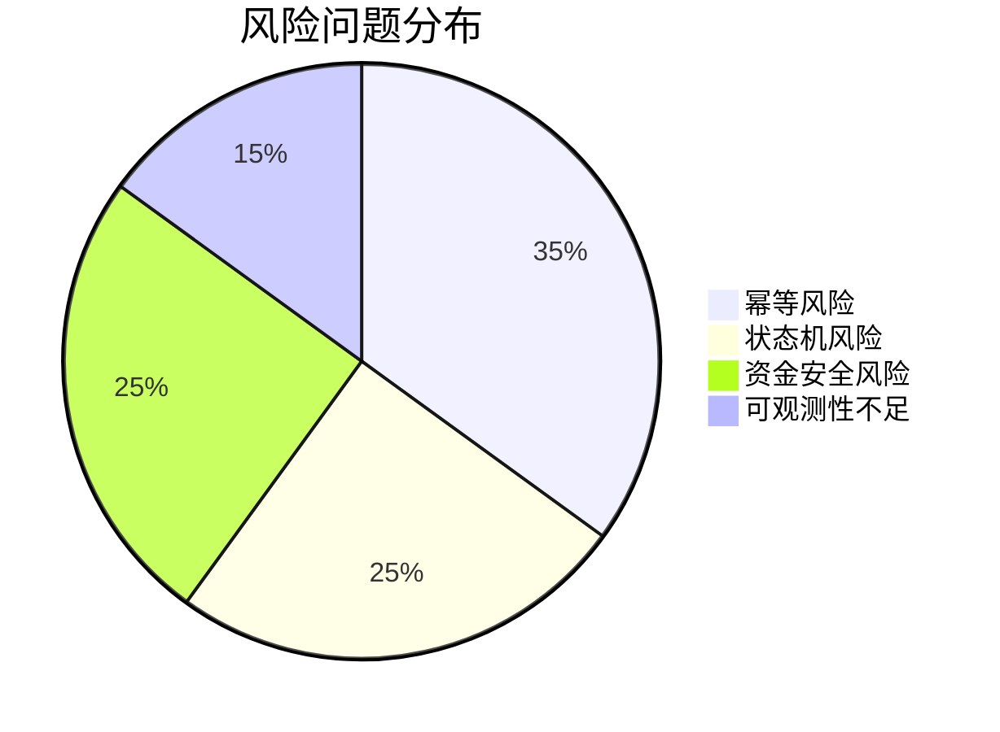

### 6.7 Mermaid Class Diagram

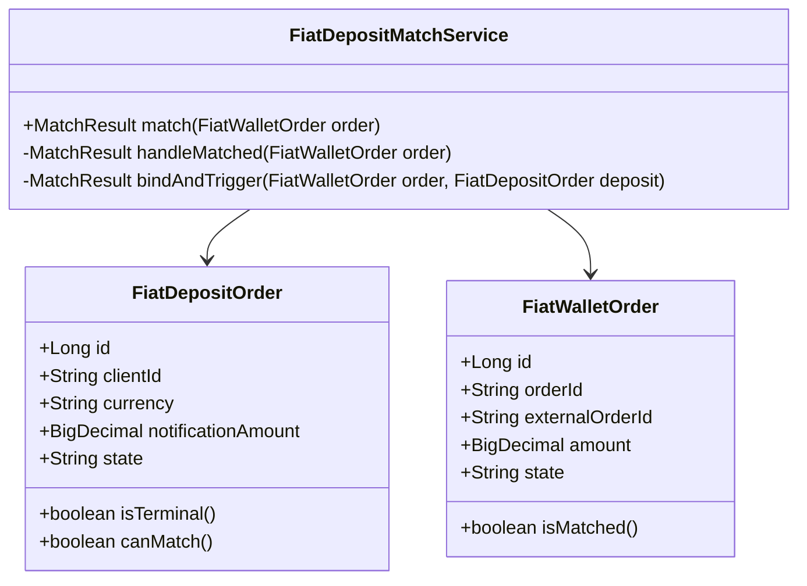

---

## 7. PlantUML 图表

### 7.1 PlantUML Sequence

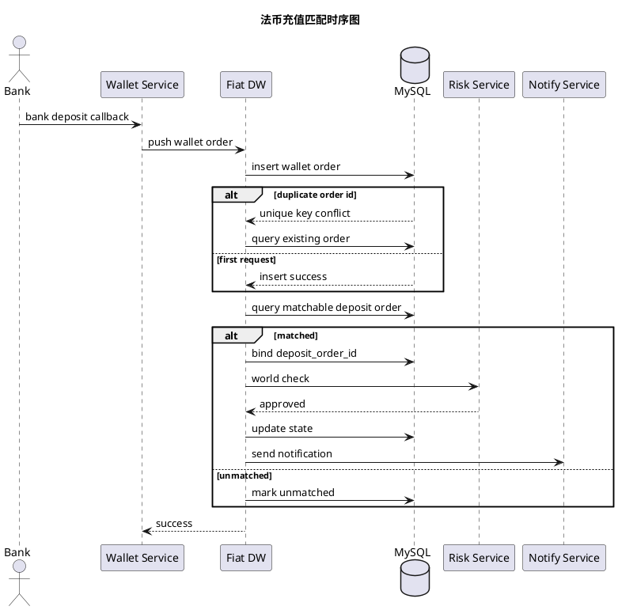

### 7.2 PlantUML Class

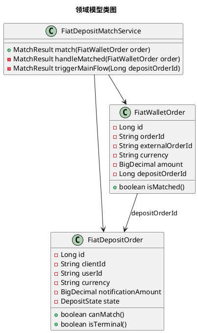

### 7.3 PlantUML Component

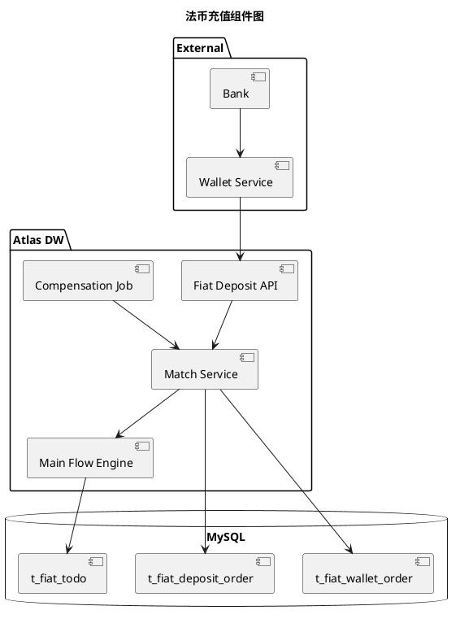

### 7.4 PlantUML State

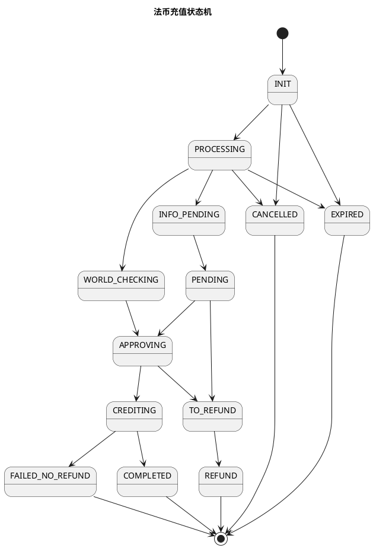

### 7.5 PlantUML Activity

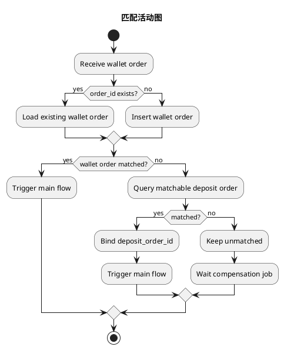

---
### 7.6 222


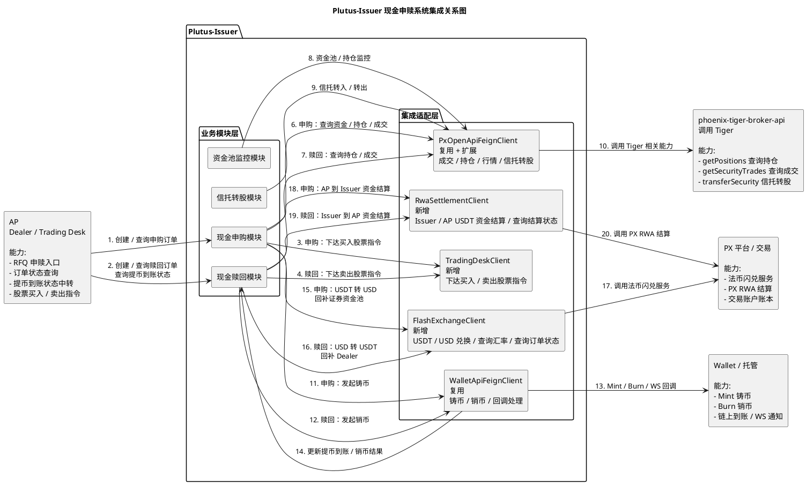


## 8. 数学公式

### 8.1 行内公式

金额匹配条件可以抽象为：`walletAmount = notificationAmount`，误差容忍范围为 $|a - b| \leq \epsilon$。

### 8.2 块级公式

$$
match(order, deposit) =
\begin{cases}
true, & order.clientId = deposit.clientId \\
true, & order.amount = deposit.notificationAmount \\
true, & order.currency = deposit.currency \\
false, & otherwise
\end{cases}
$$

### 8.3 风险评分公式

$$
RiskScore = W_1 \times AmountRisk + W_2 \times UserRisk + W_3 \times ChannelRisk
$$

其中：

- $W_1 + W_2 + W_3 = 1$
- $AmountRisk \in [0, 100]$
- $UserRisk \in [0, 100]$
- $ChannelRisk \in [0, 100]$

---

## 9. 图片与链接

### 9.1 普通链接

- [OpenAI](https://openai.com)
- [Markdown Guide](https://www.markdownguide.org)
- [Mermaid Documentation](https://mermaid.js.org)
- [PlantUML Documentation](https://plantuml.com)

### 9.2 Markdown 图片


### 9.3 HTML 图片


---

## 10. HTML 混排

### 10.1 Keyboard

保存快捷键：<kbd>Command</kbd> + <kbd>S</kbd>

格式化快捷键：<kbd>Option</kbd> + <kbd>Shift</kbd> + <kbd>F</kbd>

### 10.2 自定义块

<div style="border: 1px solid #ddd; padding: 12px; border-radius: 8px;">
  <strong>HTML Block:</strong>
  这里是一个 HTML 混排区域，用来测试 Markdown 编辑器是否支持内联 HTML。
</div>

### 10.3 GitHub 风格提示块

> [!NOTE]
> 这是一个 Note 提示块，用于展示普通提示信息。

> [!TIP]
> 这是一个 Tip 提示块，用于展示最佳实践。

> [!IMPORTANT]
> 这是一个 Important 提示块，用于展示关键说明。

> [!WARNING]
> 这是一个 Warning 提示块，用于展示潜在风险。

> [!CAUTION]
> 这是一个 Caution 提示块，用于展示高风险事项。

---

## 11. 折叠块

<details>
<summary>点击展开：匹配规则详情</summary>

### 匹配规则

钱包订单和充值通知单的匹配条件：

1. `client_id` 一致。
2. `currency` 一致。
3. `amount` 与 `notification_amount` 一致。
4. 充值单状态必须是可匹配状态。
5. 钱包订单不能已经绑定其他充值单。

示例 SQL：

```sql
SELECT *
FROM t_fiat_deposit_order
WHERE client_id = ?
  AND currency = ?
  AND notification_amount = ?
  AND state IN ('INIT', 'PROCESSING')
  AND deleted = 0
LIMIT 1;
```

</details>

<details>
<summary>点击展开：终态说明</summary>

| 状态 | 是否终态 | 是否允许继续推进 |
|---|---:|---:|
| COMPLETED | 是 | 否 |
| CANCELLED | 是 | 否 |
| EXPIRED | 是 | 否 |
| REFUND | 是 | 否 |
| FAILED_NO_REFUND | 是 | 否 |

</details>

---

## 12. 脚注与引用

### 12.1 脚注

幂等不是“最终一定要成功”，而是“同一个请求被执行一次或多次，最终效果一致”。[^idempotent]

资金安全场景下，重复请求必须被识别并收敛为同一个业务结果。[^fund-safety]

[^idempotent]: 幂等更关注“重复执行的一致性”，不是“无限重试直到成功”。
[^fund-safety]: 资金安全通常关注重复上账、漏上账、错账、状态不一致等问题。

### 12.2 引用

> 软件系统里最危险的问题，往往不是代码报错，而是“看起来成功了，但状态和资金并不一致”。

嵌套引用：

> 第一层引用
>
> > 第二层引用
> >
> > > 第三层引用

---

## 13. 综合业务示例

### 13.1 背景

当前法币充值流程中，银行侧充值订单先进入钱包侧，再由钱包侧推送到业务系统。业务系统需要根据客户、币种、金额等信息找到对应的充值通知单，并建立匹配关系。

核心挑战：

1. 钱包侧回调可能重复。
2. 补偿任务可能重复扫描。
3. 充值单可能已经撤销或失效。
4. 主流程可能已经部分推进。
5. 匹配、审批、风控、上账之间存在状态一致性风险。

### 13.2 验证目标

| 验证目标 | 说明 |
|---|---|
| 幂等性 | 相同钱包订单重复进入，不应重复绑定或重复上账 |
| 状态一致性 | 撤销、失效、失败、完成等终态不能被错误推进 |
| 补偿可重入 | 补偿任务从 match 开始重跑时，不能产生副作用 |
| 资金安全 | 避免重复上账、漏上账、错账 |
| 可观测性 | 核心异常路径有日志、指标、告警 |

### 13.3 P0 Show Case

| Case ID | 场景 | 操作步骤 | 预期结果 |
|---|---|---|---|
| P0-01 | 钱包订单首次匹配成功 | 推送新钱包订单 | 绑定充值单并推进主流程 |
| P0-02 | 钱包订单重复回调 | 同一 `order_id` 推送两次 | 只生成一条钱包订单记录 |
| P0-03 | 已匹配订单补偿重跑 | CompensationJob 扫描已匹配订单 | 进入 `handleMatched`，主流程幂等 |
| P0-04 | 充值单已撤销 | 对 `CANCELLED` 充值单执行匹配 | 不推进，不上账 |
| P0-05 | 充值单已失效 | 对 `EXPIRED` 充值单执行匹配 | 不推进，不上账 |
| P0-06 | 金额不一致 | 钱包金额与通知金额不同 | 保持未匹配 |
| P0-07 | 主流程重复触发 | 连续调用 `triggerMainFlow` | 状态不回退，不重复执行副作用 |

### 13.4 日志示例

```text
2026-06-21 10:00:01.001 INFO  [FiatDepositMatchService] receive wallet order, orderId=WO202606210001
2026-06-21 10:00:01.123 INFO  [FiatDepositMatchService] wallet order inserted, orderId=WO202606210001
2026-06-21 10:00:01.235 INFO  [FiatDepositMatchService] deposit order matched, depositOrderId=10001, walletOrderId=20001
2026-06-21 10:00:01.520 INFO  [FiatMainFlowService] trigger main flow success, depositOrderId=10001, state=PROCESSING
```

### 13.5 指标示例

```text
fiat_wallet_order_callback_total{channel="bank", result="success"} 100
fiat_wallet_order_callback_total{channel="bank", result="duplicate"} 5
fiat_deposit_match_total{result="matched"} 80
fiat_deposit_match_total{result="unmatched"} 20
fiat_deposit_main_flow_trigger_total{result="success"} 75
fiat_deposit_main_flow_trigger_total{result="blocked_terminal_state"} 3
```

### 13.6 最终验证结论模板

| 验证项 | 结论 | 备注 |
|---|---|---|
| 幂等表唯一键 | 通过 | `order_id` 唯一 |
| 已匹配重入 | 通过 | `handleMatched -> triggerMainFlow` 可重复调用 |
| 终态保护 | 通过 | `CANCELLED / EXPIRED / COMPLETED` 不继续推进 |
| 金额一致性 | 通过 | 金额不一致不匹配 |
| 补偿任务 | 通过 | 可重复扫描 |
| 资金安全 | 待确认 | 需要联调钱包侧回调重试场景 |

---

## 14. 特殊字符测试

### 14.1 中文标点

，。！？；：“”‘’（）【】《》——……￥

### 14.2 英文标点

,.!?;:"'()[]{}<>-_+=|\/`~@#$%^&*

### 14.3 Emoji

- ✅ 成功
- ❌ 失败
- ⚠️ 风险
- 🚀 发布
- 🔒 安全
- 🧪 测试
- 📈 指标
- 🧭 流程

---

## 15. 长文本压力测试

下面是一段较长的文本，用于测试编辑器在换行、复制、选中、滚动、缩放场景下是否稳定。

法币充值匹配流程的核心难点不在于单次请求是否能够成功处理，而在于多个异步来源、多个补偿任务、多个状态机节点同时存在时，系统能否保证最终业务结果一致。尤其是在钱包侧回调重试、银行订单延迟到达、用户主动撤销、运营手动失效、风控审批异步返回等场景下，如果缺少清晰的幂等边界和终态保护，就可能出现重复上账、状态回退、错误匹配、漏处理等问题。因此，任何涉及资金流转的流程升级，都应该优先验证幂等性、状态一致性、补偿可重入性和资金安全。

---

## 16. 结尾

本文档到此结束。

最后检查项：

- [ ] 标题渲染正常
- [ ] 表格渲染正常
- [ ] 代码块可选中、可复制
- [ ] Mermaid 可渲染
- [ ] PlantUML 可渲染
- [ ] 数学公式可渲染
- [ ] HTML 混排正常
- [ ] 折叠块正常
- [ ] 长文滚动流畅
- [ ] 缩放不卡顿

