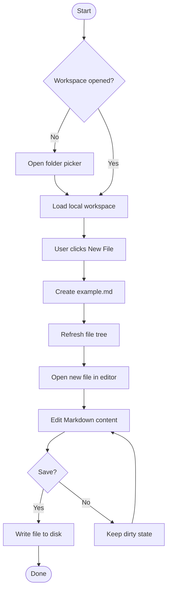
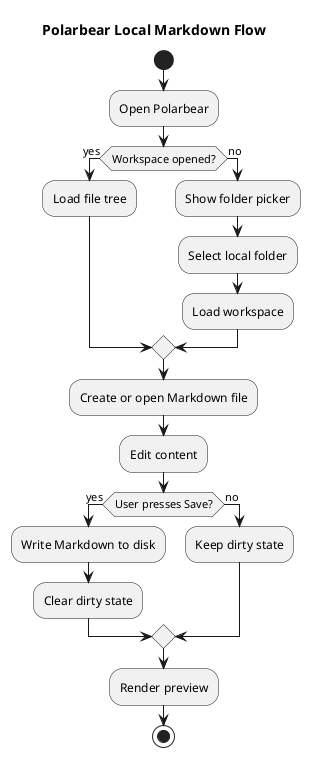
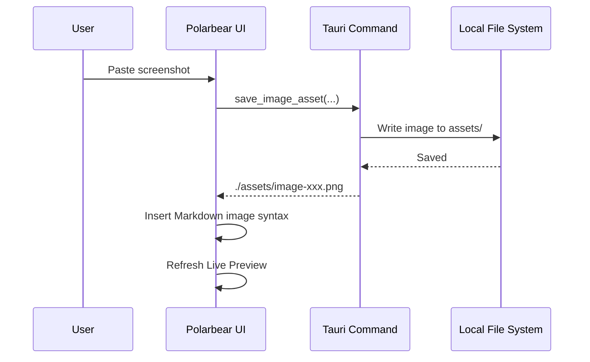
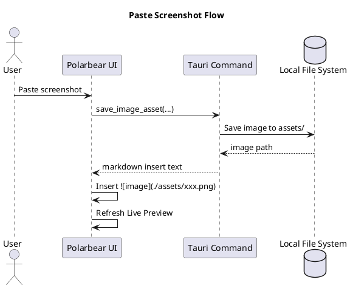

# Diagram Render Test

## 1. Mermaid Flowchart

```mermaid
flowchart TD
    A([Start]) --> B{Workspace opened?}
    B -- No --> C[Open folder picker]
    C --> D[Load local workspace]
    B -- Yes --> D

    D --> E[User clicks New File]
    E --> F[Create example.md]
    F --> G[Refresh file tree]
    G --> H[Open new file in editor]
    H --> I[Edit Markdown content]
    I --> J{Save?}
    J -- Yes --> K[Write file to disk]
    J -- No --> L[Keep dirty state]
    K --> M([Done])
    L --> I
```

## 2. PlantUML Flowchart

```plantuml
@startuml
title Polarbear Local Markdown Flow

start

:Open Polarbear;

if (Workspace opened?) then (yes)
  :Load file tree;
else (no)
  :Show folder picker;
  :Select local folder;
  :Load workspace;
endif

:Create or open Markdown file;
:Edit content;

if (User presses Save?) then (yes)
  :Write Markdown to disk;
  :Clear dirty state;
else (no)
  :Keep dirty state;
endif

:Render preview;

stop
@enduml
```

## 3. Mermaid Sequence Diagram

```mermaid
sequenceDiagram
    participant U as User
    participant UI as Polarbear UI
    participant T as Tauri Command
    participant FS as Local File System

    U->>UI: Paste screenshot
    UI->>T: save_image_asset(...)
    T->>FS: Write image to assets/
    FS-->>T: Saved
    T-->>UI: ./assets/image-xxx.png
    UI->>UI: Insert Markdown image syntax
    UI->>UI: Refresh Live Preview
```

## 4. PlantUML Sequence Diagram

```plantuml
@startuml
title Paste Screenshot Flow

actor User
participant "Polarbear UI" as UI
participant "Tauri Command" as Tauri
database "Local File System" as FS

User -> UI: Paste screenshot
UI -> Tauri: save_image_asset(...)
Tauri -> FS: Save image to assets/
FS --> Tauri: image path
Tauri --> UI: markdown insert text
UI -> UI: Insert ![image](./assets/xxx.png)
UI -> UI: Refresh Live Preview

@enduml
```