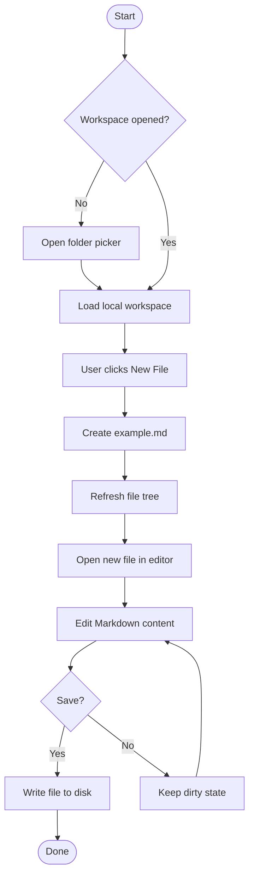
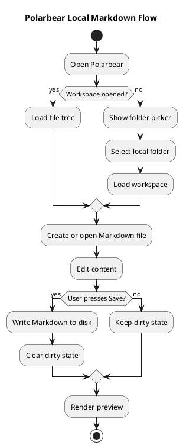
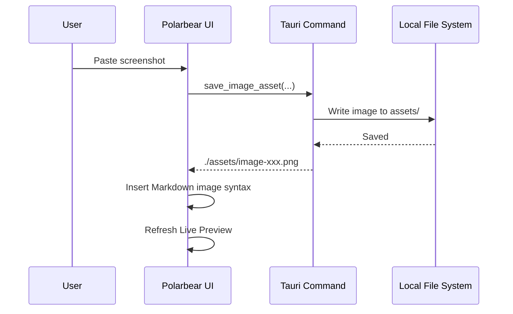
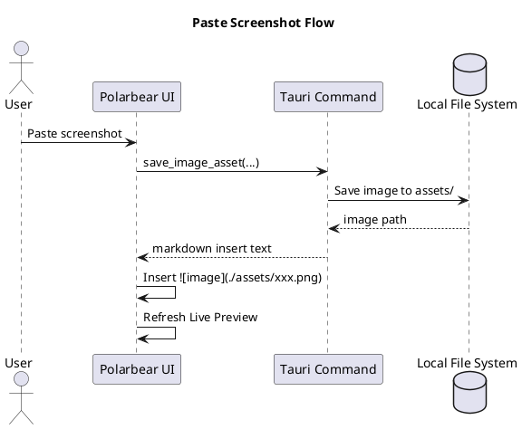
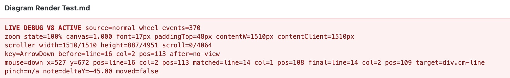

# Diagram Render Test

## 1. Mermaid Flowchart


|      |      |
| ---- | :--: |
|      |      |
|      |      |


2
222222


```java
public class A {
  
}
```
2
```java
sasdfasdf
```
2


[1111.md](1111.md)
```java
public class A {
  aasdf[1.md](1.md)
}
[1111.md](1111.md)
```
<u>222222222</u>
**22222222222**
2
*222222222222*
22
2
```java
123123123
```
2
2
```java
234234
```
2

| 123123123 | 1231 | 123  |
| --------- | ---- | ---- |
|           |      | 123  |
|           | 123  | 123  |
| 123       | 123  |      |


```json
123123

```




## 2. PlantUML Flowchart



## 3. Mermaid Sequence Diagram



## 4. PlantUML Sequence Diagram




# 5.图片


2


2


22


5. 1
6. 11
7. as
8. d


